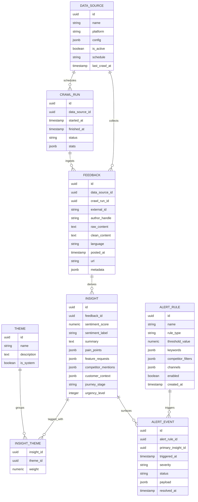

# Voice of Customer Analysis Service

## Development Setup

- Install Python dependencies:
  ```bash
  uv pip install -r voc_app/requirements.txt
  ```

- Install frontend dependencies:
  ```bash
  cd voc_app/frontend
  npm install
  ```

- Install pre-commit hooks:
  ```bash
  pre-commit install --config voc_app/.pre-commit-config.yaml
  ```

## Available Commands

- Run FastAPI app locally:
  ```bash
  uvicorn voc_app.main:app --reload
  ```

- Run frontend dev server:
  ```bash
  cd voc_app/frontend
  npm run dev
  ```

- Manage database migrations:
  ```bash
  # Generate a new revision after modifying models
  alembic -c voc_app/alembic.ini revision --autogenerate -m "describe change"

  # Apply migrations
  alembic -c voc_app/alembic.ini upgrade head

  # Roll back one migration
  alembic -c voc_app/alembic.ini downgrade -1
  ```

## CLI Usage

The VoC application provides a CLI for testing crawls, processing, and checking status:

- Initialize database:
  ```bash
  python -m voc_app.cli init
  ```

- Run a crawl:
  ```bash
  # Reddit crawl
  python -m voc_app.cli crawl --platform reddit --source "product-feedback" --query "ProductName"

  # Twitter crawl
  python -m voc_app.cli crawl --platform twitter --source "social-mentions" --query "ProductName"

  # YouTube crawl (video ID)
  python -m voc_app.cli crawl --platform youtube --source "youtube-feedback" --query "dQw4w9WgXcQ"

  # Trustpilot crawl
  python -m voc_app.cli crawl --platform trustpilot --source "reviews" --query "company-name"

  # Quora crawl
  python -m voc_app.cli crawl --platform quora --source "questions" --query "ProductName"

  # G2 crawl
  python -m voc_app.cli crawl --platform g2 --source "software-reviews" --query "product-slug"

  # Dry-run mode (no storage)
  python -m voc_app.cli crawl --platform reddit --source "test" --query "test" --dry-run
  ```

- Check crawl status:
  ```bash
  # All recent runs
  python -m voc_app.cli status

  # Filter by source
  python -m voc_app.cli status --source "product-feedback"
  ```

- List data sources:
  ```bash
  python -m voc_app.cli sources
  ```

## Background Tasks (Celery)

The application uses Celery for background processing with Redis as broker:

- Start Celery worker:
  ```bash
  celery -A voc_app.celery_app worker --loglevel=info
  ```

- Start Celery beat scheduler:
  ```bash
  celery -A voc_app.celery_app beat --loglevel=info
  ```

- Monitor tasks with Flower:
  ```bash
  celery -A voc_app.celery_app flower
  ```

### Task Queues

- **crawl**: Web crawling operations
- **processing**: Insight extraction and classification
- **alerts**: Alert rule evaluation and notifications

### Scheduled Tasks

- `run_scheduled_crawls`: Every 15 minutes
- `process_pending_feedback`: Every 30 minutes
- `evaluate_alert_rules`: Every 5 minutes
- `discover_emerging_themes`: Every 6 hours

## Alert System

The VoC application includes a comprehensive alert detection engine:

### Alert Rule Types

- **sentiment_threshold**: Trigger when average sentiment drops below threshold
- **keyword**: Match specific keywords in feedback (crashes, bugs, issues)
- **competitor_mention**: Detect mentions of competitor products
- **urgency**: Flag high-urgency customer issues
- **volume_spike**: Detect unusual volume of feedback

### Notification Channels

- **Email**: HTML-formatted email notifications with severity color-coding
- **Webhook**: Generic HTTP webhook with JSON payload
- **Slack**: Slack-specific webhook with rich formatting

### Alert Severity Levels

- **critical**: Requires immediate attention
- **high**: Important, should be addressed soon
- **medium**: Normal priority
- **low**: For awareness

## REST API

The application provides a comprehensive REST API for managing and querying VoC data:

### Base URL
```
http://localhost:8000/api/v1
```

### Authentication
API requests require an `X-API-Key` header:
```bash
curl -H "X-API-Key: your-api-key" http://localhost:8000/api/v1/sources
```

### Endpoints

**Data Sources**
- `GET /sources` - List all data sources
- `POST /sources` - Create a new data source
- `GET /sources/{id}` - Get a specific data source
- `PATCH /sources/{id}` - Update a data source
- `DELETE /sources/{id}` - Delete a data source

**Crawl Runs**
- `GET /crawls` - List crawl runs
- `GET /crawls/{id}` - Get a specific crawl run

**Feedback**
- `GET /feedback` - List feedback items
- `GET /feedback/{id}` - Get a specific feedback item

**Insights**
- `GET /insights` - List insights (supports filters: `min_sentiment`, `max_sentiment`, `min_urgency`)
- `GET /insights/{id}` - Get a specific insight

**Themes**
- `GET /themes` - List themes
- `POST /themes` - Create a new theme
- `GET /themes/{id}` - Get a specific theme
- `PATCH /themes/{id}` - Update a theme
- `DELETE /themes/{id}` - Delete a theme

**Alerts**
- `GET /alerts/rules` - List alert rules
- `POST /alerts/rules` - Create a new alert rule
- `GET /alerts/rules/{id}` - Get a specific alert rule
- `PATCH /alerts/rules/{id}` - Update an alert rule
- `DELETE /alerts/rules/{id}` - Delete an alert rule
- `GET /alerts/events` - List alert events
- `GET /alerts/events/{id}` - Get a specific alert event
- `POST /alerts/events/{id}/resolve` - Resolve an alert event

**Exports**
- `GET /exports/insights/csv` - Export insights to CSV format
- `GET /exports/insights/json` - Export insights to JSON format
- `GET /exports/insights/excel` - Export insights to Excel format (requires openpyxl)

**Webhooks**
- `GET /webhooks` - List webhook subscriptions
- `POST /webhooks` - Create a new webhook subscription
- `GET /webhooks/{id}` - Get a specific webhook subscription
- `PATCH /webhooks/{id}` - Update a webhook subscription
- `DELETE /webhooks/{id}` - Delete a webhook subscription

### Pagination
All list endpoints support pagination:
```
GET /api/v1/sources?skip=0&limit=50
```

### Rate Limiting
API requests are limited to 100 requests per minute per IP address.

### API Documentation
Interactive API documentation is available at:
- Swagger UI: `http://localhost:8000/docs`
- ReDoc: `http://localhost:8000/redoc`

## Data Model Overview

- **Sources (`data_sources`)** capture platform configuration, schedules, and credentials.
- **Crawl runs (`crawl_runs`)** log each execution, linking back to a source with timing and stats.
- **Feedback (`feedback`)** stores raw and cleaned customer content plus metadata (author, timestamps, URLs, geo, language).
- **Insights (`insights`)** hold GPT-5 extractions including sentiment, pain points, feature requests, and context.
- **Themes (`themes`)** provide reusable taxonomies for grouping insights (via the `insight_themes` join table with weights).
- **Alert rules (`alert_rules`)** define triggers (thresholds, keywords, competitor signals) and delivery channels.
- **Alert events (`alert_events`)** record fired alerts with linked insights and resolution state.


